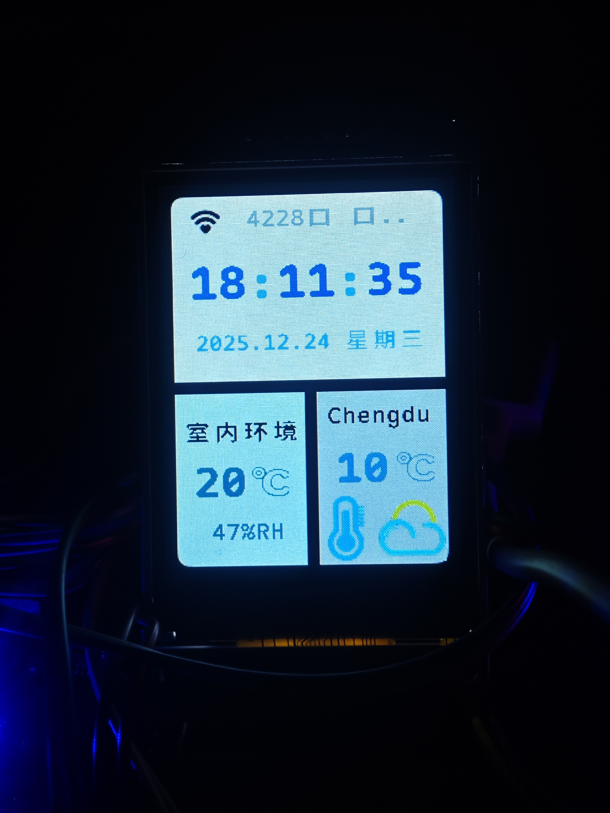
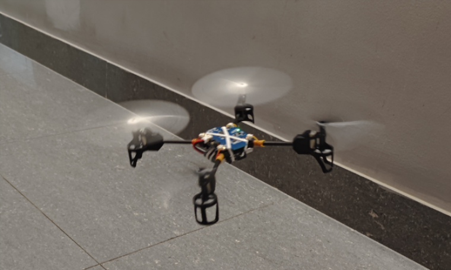
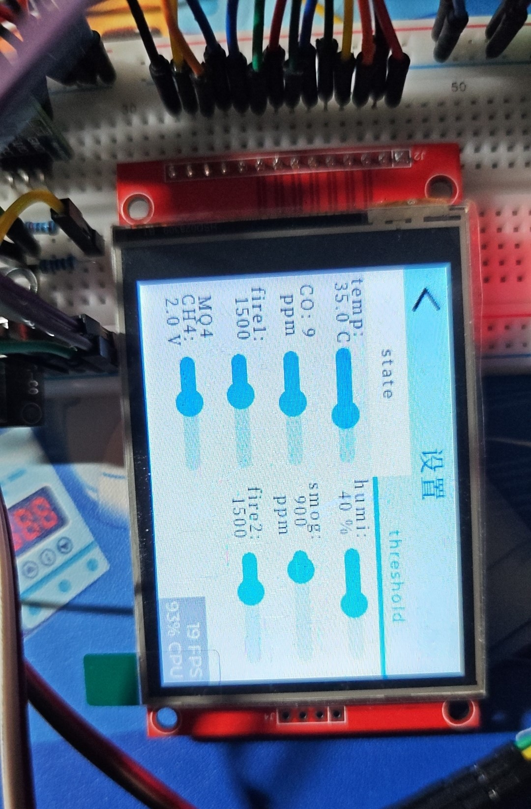

# stm32-practice
STM32 learning projects and practice code.

1.IoT 天气终端（STM32F4 + ESP32）
  -  Workqueue 任务调度
  -  UI 线程解耦（无优先级翻转）
  -  ESP32 AT 通信框架
  -  支持 OTA 升级（断电恢复）

📷 实物展示：  

---

2.四轴飞行器飞控系统（STM32F1）
  -  6ms 控制周期 RTOS 架构
  -  四元数姿态解算
  -  串级 PID
  -  激光定高

📷 实物展示：  

---

3.环境监测 IoT 终端（MQTT + LVGL）
  -  MQTT + 阿里云完整链路
  -  cJSON 数据解析（抗粘包）
  -  自动 / 手动双模式控制
  -  LVGL 图形界面

📷 实物展示：  

